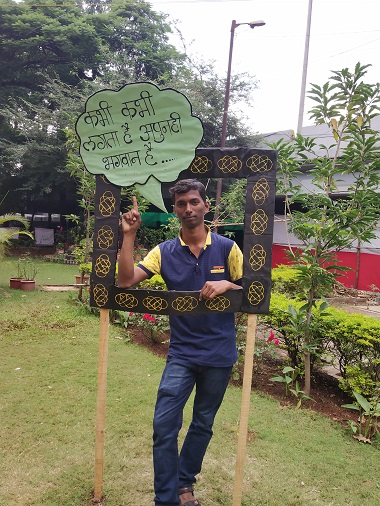
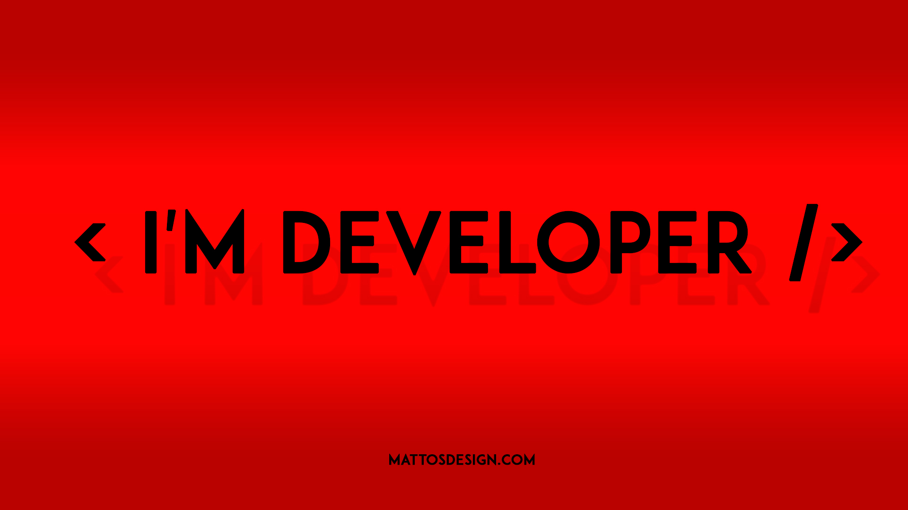
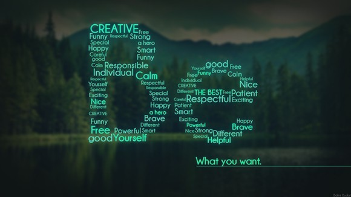

<!DOCTYPE >
<html lang="zxx">

<head>
	<title></title>

	<!--meta tags -->
	<meta charset="UTF-8">
	<meta name="viewport" content="width=device-width, initial-scale=1">
	<meta name="keywords" content="Intro Responsive web template, Bootstrap Web Templates, Flat Web Templates, Android Compatible web template, 
Smartphone Compatible web template, free webdesigns for Nokia, Samsung, LG, SonyEricsson, Motorola web design" />
	
	<!--//meta tags ends here-->
	<!--booststrap-->
	<link href="css/bootstrap.css" rel="stylesheet" type="text/css" media="all">
	<!--//booststrap end-->
	<!-- font-awesome icons -->
	<link href="css/font-awesome.css" rel="stylesheet">
	<!-- //font-awesome icons -->
<!-- Nav-CSS -->	
<link href="css/nav.css" rel="stylesheet" type="text/css" media="all" />
 
<!-- //Nav-CSS -->	
	<link rel="stylesheet" href="css/lightbox.css">
	<!--gallery-->

	<!--stylesheets-->
	<link href="css/style.css" rel='stylesheet' type='text/css' media="all">
	<!--//stylesheets-->

	<link href="//fonts.googleapis.com/css?family=Montserrat:300,400,500" rel="stylesheet">

</head>
<body>
<!-- navigation section -->
	

		

		

 

		<button id="trigger-overlay" type="button">
			
		</button>
		

	<!-- open/close -->
		

			<button type="button" class="overlay-close">Close</button>
			<nav>
				<ul>
					<li><a href="#index.html" class="scroll">Home</a></li>
					<li><a href="#about" class="scroll" >About</a></li>
					<li><a href="#experience" class="scroll" >Qualification</a></li>
					<li><a href="#gallery" class="scroll" >Gallery</a></li>
					<li><a href="#contact" class="scroll" >Hire me</a></li>

				</ul>
			</nav>
		

					

				<h1><a href="index.html">Intro</a></h1>
		

	<!-- /open/close -->
<!-- /navigation section -->

 

<!-- Slideshow 4 -->
		

			

				<ul class="rslides" id="slider4">
					<li>
						

							

								

									<h4>I am ANKIT MAURYA 
										</h4>
									
Web Developer

								

							

						

					</li>
					<li>
						

							

								

									<h4>I am a student of <i>IIIT PUNE</i>
										 </h4>
									
BRANCH : COMPUTER SCIENCE & ENGINEERING

								

							

						

					</li>
				</ul>
			

			
 

		

		<!-- This is here just to demonstrate the callbacks -->
		<!-- <ul class="events">
      <li>Example 4 callback events</li>
    </ul>-->

<!-- //banner -->
<!--about -->
	

		

		

					
				

				

				

				<h2>ANKIT MAURYA </h2>
				<h4>Web Design & Web Developer</h4>
				

				

				
Nothing to say about me

				

								<a href="#services">Read More</a>
							

							

					<ul>
						<li><a href="https://www.facebook.com/me.vector.ankitmaurya"></a></li>
						<li><a href="#"></a></li>
						<li><a href="#"></a></li>
						<li><a href="#"></a></li>
					</ul>
				

							

							
				

				
 

				

				

				<h3>My Personal Data</h3>
				<ul class="address">
										<li>
							<ul class="address-text ">
								<li><b>Name </b></li>
								<li>:ANKIT MAURYA</li>
							</ul>
						</li>
						<li>
							<ul class="address-text ">
								<li><b>D.O.B </b></li>
								<li>:20-03-2000</li>
							</ul>
						</li>
						<li>
							<ul class="address-text">
								<li><b>PHONE </b></li>
								<li>:+91 9521794609</li>
							</ul>
						</li>
						<li>
							<ul class="address-text">
								<li><b>ADDRESS </b></li>
								<li>:PADHUA , BELWAR , JAUNPUR , UTTAR PRADESH , PIN - 222201</li>
							</ul>
						</li>
						<li>
							<ul class="address-text">
								<li><b>E-MAIL </b></li>
								<li><a href="ankitmauryavector@gmail.com">: ankitmauryavector@gmail.com</a></li>
							</ul>
						</li>
						
					</ul> 
			

						<a href="#" class="there-more"> 
							Download				
						</a> 
						<a href="#" class="there-more"> 
						Hire Me
						</a>
					

				

				

								
								

								

								
								<h3>web Design</h3>
								
It's my passion

								

								
 

								

								

								

																<h3>ANDROID APP DEVELOPMENT</h3>
                           
I wants to be a pro APP Developer

								

								
 

								

								

								

								
								<h3>Photoshop</h3>
								
It's a part time cretivity for me 

								

								
 

								

								

								

								
								<h3>Web Design</h3>
								
Working on it since august 2k18

								

								
 

								

							
	
							
 

							

							
 

			
					

				
 

			
		
		

				<!--// services-->

	

		

		

		 <h4>education</h4>
		

		

		

		<h6>2014-2015</h6>
		<h5>High School</h5>
		
Rastriya Intermediate College, Jaunpur

		

		

				<h6>2015-2017</h6>
		<h5>Intermediate</h5>
		
Rastriya Intermediate College, Jaunpur

		

		
		

				<h6>2018-2022</h6>
		<h5>Bachelor of Technology</h5>
		
Computer Science & Engineering

		
Currently studying

		
INDIAN INSTITUTE OF INFORMATION TECHNOLOGY , PUNE

		

		
		

				<h6>2013-2017</h6>
		<h5>Achievement</h5>
		
National Means cum Merit Scholership

		

	
		

		

			
<!-- gallery-->
	

	

			<h3 class="title clr">Gallery</h3>
			

				

					
				

				

					
				

				

					
				

				

					
				

				

					
				

				

					
				

				

					
				

				

					
				

				

					
				

								

					
				

				

					
				

				

					
				

			

	

	

	<!-- //gallery-->
	

	

	
<!--contact-->
	

		

			<h3 class="title">Contact</h3>
						

				<form action="#" method="post">
					

						<input type="text" name="Name" placeholder="Name" required="">
					

					

						<input type="text" name="Last Name" placeholder="Last Name" required="">
					

					

						<input type="email" name="Email" placeholder="Email" required="">

					

					

						<input type="text" name="phone" placeholder="phone" required="">

					

					
 

					

						<textarea name="Message" placeholder="Message" required=""></textarea>
					

					

						

							<input type="submit" value="SEND">
						

					

				</form>
			

			
 

			

				

					<iframe src="https://www.google.com/maps/embed?pb=!1m18!1m12!1m3!1d3777.847642103837!2d73.7538972152412!3d18.76034128726985!2m3!1f0!2f0!3f0!3m2!1i1024!2i768!4f13.1!3m3!1m2!1s0x3bc2b405ac494d45%3A0xc302bc70566bb0f8!2sIndian+Institute+of+Information+Technology%2C+Pune!5e0!3m2!1sen!2sin!4v1539961581954" width="600" height="450" frameborder="0" style="border:0" allowfullscreen></iframe>
					

				

					<h5>Address</h5>
					
Indian Institute of Information Technology , Pune maharastra,412109,
					india

				

				

					<h5> Contact</h5>
					
+91 9521794609 

				

				

					<h5>Email</h5>
					
<a href="mailto:info@example.com">ankitmauryavector@gmail.com</a>
					<a href="mailto:info@example.com">ankitmauryavector@hotmail.com</a>

				

			

				

			

			
 

			

              

              	<iframe src="https://www.facebook.com/plugins/post.php?href=https%3A%2F%2Fwww.facebook.com%2Fme.vector.ankitmaurya%2Fposts%2F2200237136969709%3A4&width=500" width="500" height="531" style="border:none;overflow:hidden" scrolling="no" frameborder="0" allowTransparency="true" allow="encrypted-media"></iframe>
		
<a href ="http://www.facebook.com/profilepicframes/?selected_overlay_id=1836858989696669 "><button style="background-color:blue" >CLICK HERE FOR FACEBOOK PROFILE FRAME OF IIIT PUNE</button></a>

              	<iframe src="https://www.facebook.com/plugins/post.php?href=https%3A%2F%2Fwww.facebook.com%2Fme.vector.ankitmaurya%2Fposts%2F2193474707645952&width=500" width="500" height="380" style="border:none;overflow:hidden" scrolling="no" frameborder="0" allowTransparency="true" allow="encrypted-media"></iframe>
              	

			

			
			
 

		
		

	

<footer>

					<ul>
						<li><a href="https://www.facebook.com/me.vector.ankitmaurya?fref=comp"></a></li>
						<li><a href="#"></a></li>
						<li><a href="#"></a></li>
						<li><a href="#"></a></li>
					</ul>
				

		
© 2018 Intro. All Rights Reserved with Vector | Design by <a href="http://google.com/" target="_blank"> Ankit Maurya </a>

	</footer>
	<!--js working-->
	
	
	<!--//js working-->
	<!--nav menu-->
		
		
<!-- //nav menu-->	
	<!-- gallery -->
	
	<!-- //gallery -->
<!--banner-->

	

	
	<!--// banner-->
	<!-- OnScroll-Number-Increase-JavaScript -->
	
	
	
	<!-- //OnScroll-Number-Increase-JavaScript -->

<!-- start-smoth-scrolling -->
	
	
	
	<!-- start-smoth-scrolling -->
	<!-- here stars scrolling icon -->
	
	<!-- //here ends scrolling icon -->
</body>
